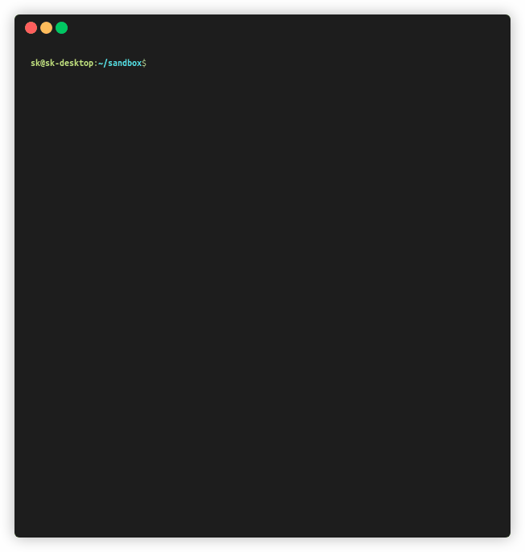

<p align="center">
  <a href="https://github.com/skmatz/imcat">
    
  </a>
</p>

<p align="center">
  <a href="https://github.com/skmatz/imcat/actions?query=workflow%3Abuild">
    
  </a>
  <a href="./LICENSE">
    
  </a>
  <a href="./go.mod">
    
  </a>
  <a href="https://github.com/skmatz/imcat/releases/latest">
    
  </a>
</p>

<p align="center">
  
</p>

## Install

### Binary

Get binary from [releases](https://github.com/skmatz/imcat/releases).

### Source

```sh
go get github.com/skmatz/imcat
```
